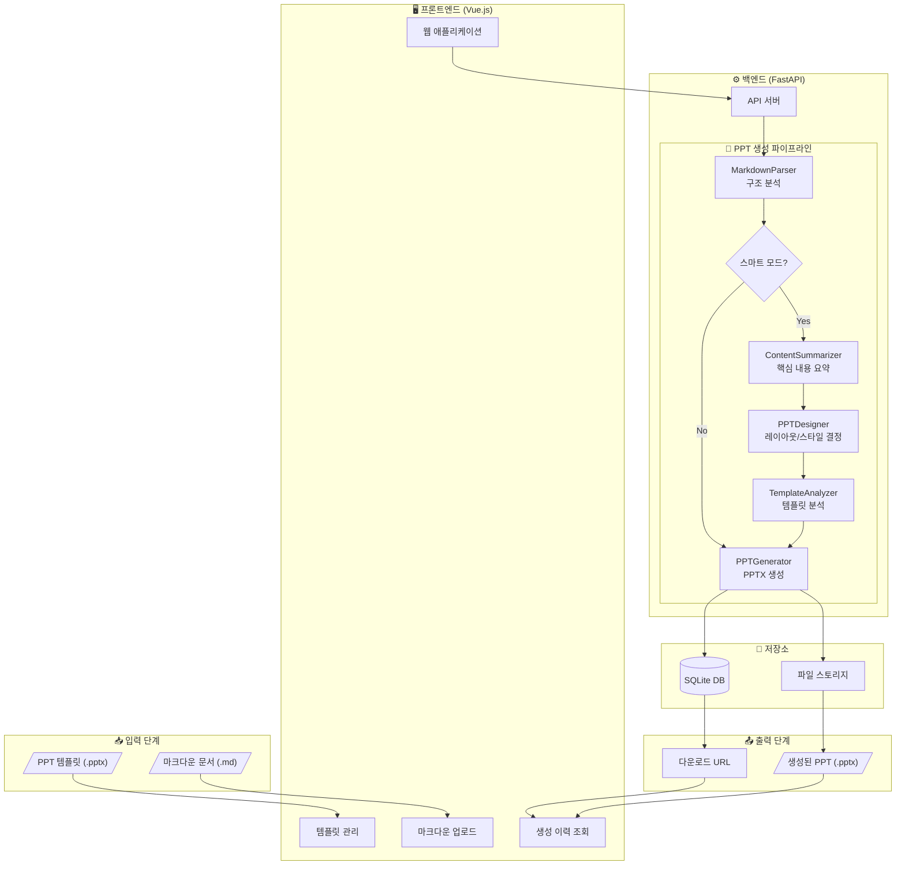

# PPT 문서 자동화 시스템 - 프로세스 흐름도

## 전체 프로세스 다이어그램

---

## 📋 프로세스 설명

| 단계 | 컴포넌트 | 역할 |
|------|----------|------|
| **1. 입력** | 사용자 | 마크다운 문서와 PPT 템플릿을 업로드 |
| **2. 파싱** | `MarkdownParser` | 마크다운을 구조화된 슬라이드 데이터로 변환 |
| **3. 요약** | `ContentSummarizer` | 긴 텍스트를 슬라이드에 적합하게 요약 |
| **4. 디자인** | `PPTDesigner` | 각 슬라이드의 레이아웃과 스타일 결정 |
| **5. 템플릿 분석** | `TemplateAnalyzer` | 템플릿의 플레이스홀더 위치 파악 |
| **6. 생성** | `PPTGenerator` | 최종 PPTX 파일 렌더링 |
| **7. 출력** | 시스템 | DB 기록 후 다운로드 URL 제공 |

---

*생성일: 2026-01-06*
