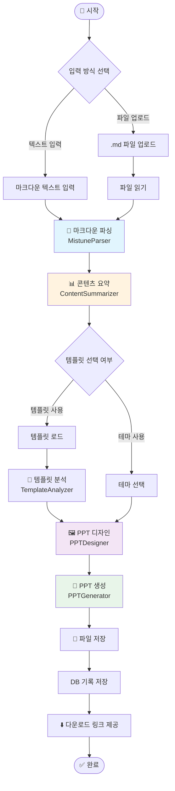
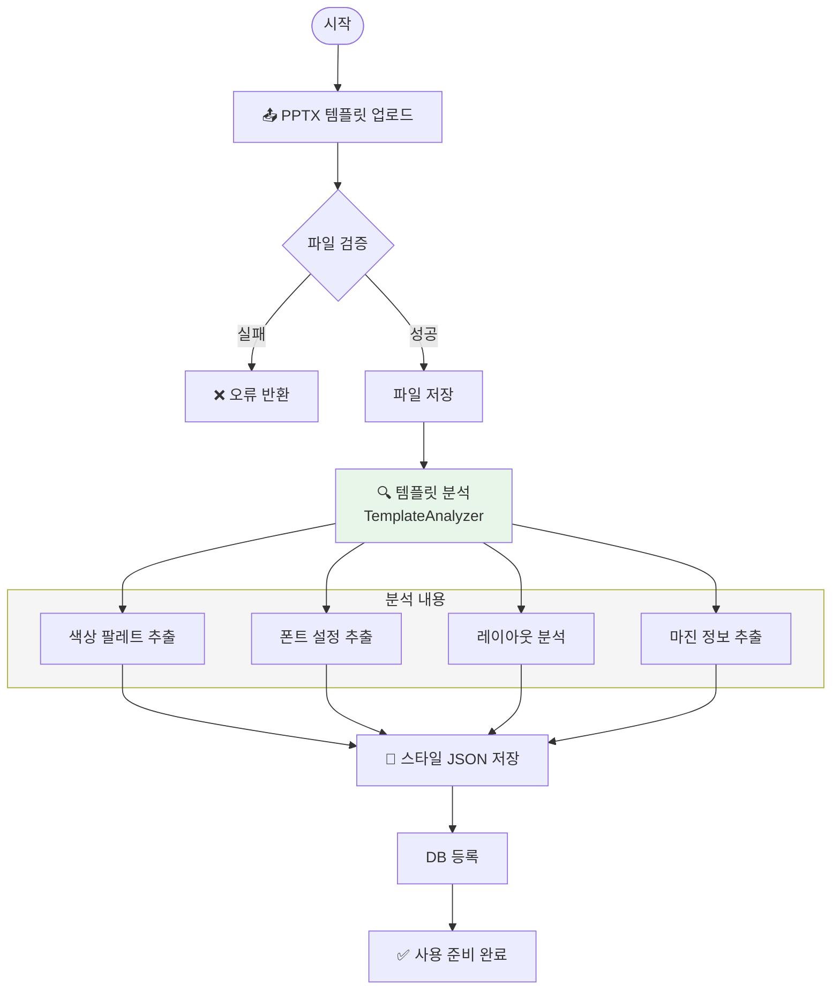
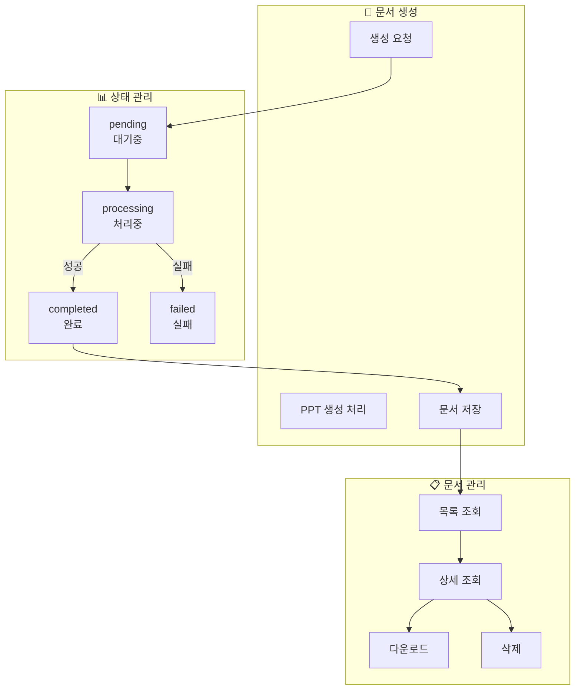
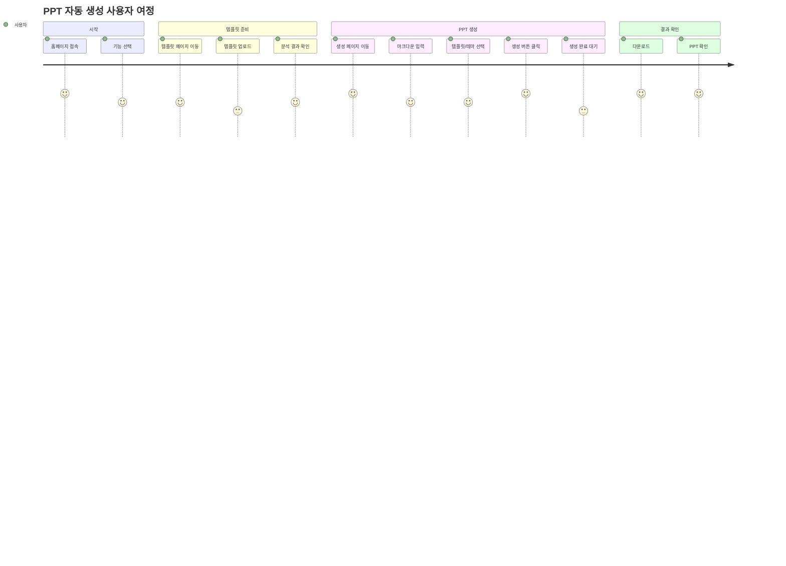
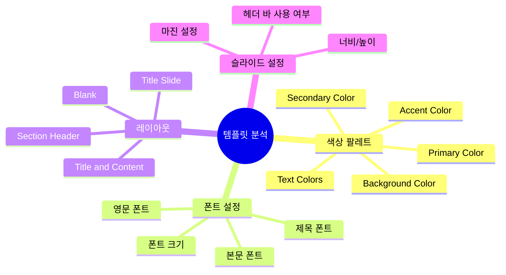
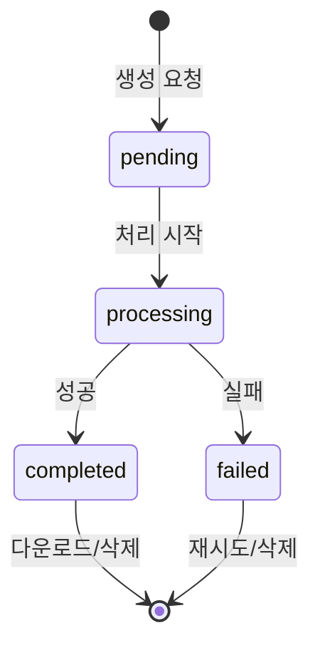
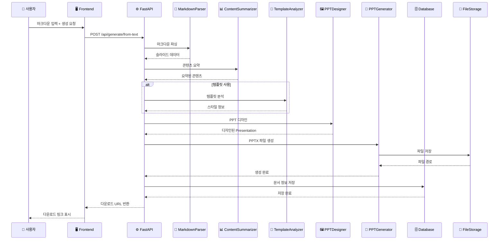
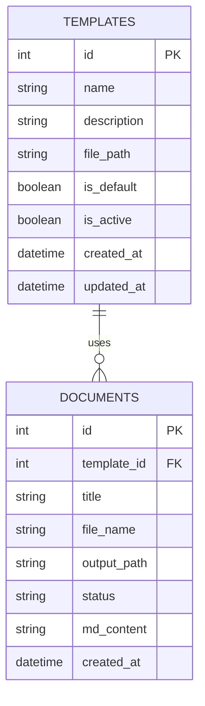
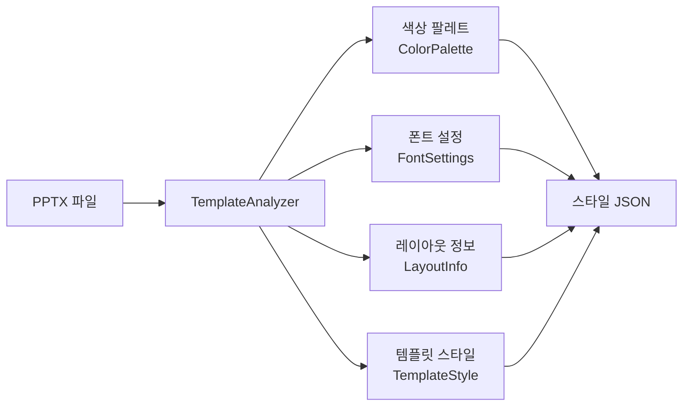

# PPT 문서 자동화 시스템 - 프로젝트 분석 보고서

> **대상 독자**: 개발 경력 2년차 개발자
> **작성일**: 2026-01-05
> **버전**: 1.0

---

## 목차

1. [프로젝트 개요](#1-프로젝트-개요)
2. [시스템 아키텍처](#2-시스템-아키텍처)
3. [프로세스 정의서](#3-프로세스-정의서)
4. [기능 정의서](#4-기능-정의서)
5. [데이터 흐름](#5-데이터-흐름)
6. [핵심 컴포넌트 상세](#6-핵심-컴포넌트-상세)
7. [API 명세 요약](#7-api-명세-요약)
8. [프론트엔드 구조](#8-프론트엔드-구조)
9. [개발 가이드](#9-개발-가이드)

---

## 1. 프로젝트 개요

### 1.1 프로젝트 목적

**PPT 문서 자동화 시스템**은 마크다운(`.md`) 파일을 입력받아 전문적인 PowerPoint(`.pptx`) 프레젠테이션을 자동으로 생성하는 풀스택 웹 애플리케이션입니다.

### 1.2 핵심 가치

| 구분 | 설명 |
|------|------|
| **개발자 친화적** | 익숙한 마크다운 문법으로 문서 작성 |
| **자동화** | 반복적인 PPT 제작 작업 자동화 |
| **템플릿 기반** | 기업/프로젝트별 커스텀 템플릿 지원 |
| **스마트 변환** | 콘텐츠 요약 및 최적화된 레이아웃 자동 적용 |

### 1.3 기술 스택

```
┌─────────────────────────────────────────────────────────────┐
│                      Frontend                                │
│  Vue.js 3 + Vite + Pinia + Vue I18n + Vue Router            │
├─────────────────────────────────────────────────────────────┤
│                       Backend                                │
│  Python 3.11 + FastAPI + SQLAlchemy + python-pptx           │
├─────────────────────────────────────────────────────────────┤
│                      Database                                │
│                       SQLite                                 │
├─────────────────────────────────────────────────────────────┤
│                    Infrastructure                            │
│              Docker + Docker Compose + Nginx                 │
└─────────────────────────────────────────────────────────────┘
```

---

## 2. 시스템 아키텍처

### 2.1 전체 아키텍처 다이어그램

```mermaid
graph TB
    subgraph Frontend["🖥️ Frontend (Vue.js 3)"]
        UI[사용자 인터페이스]
        Router[Vue Router]
        Store[Pinia Store]
        API_Client[Axios API Client]
    end

    subgraph Backend["⚙️ Backend (FastAPI)"]
        FastAPI[FastAPI Application]
        
        subgraph Routers["📡 API Routers"]
            R1[/api/templates]
            R2[/api/documents]
            R3[/api/generate]
        end
        
        subgraph Services["🔧 Core Services"]
            S1[MarkdownParser]
            S2[ContentSummarizer]
            S3[TemplateAnalyzer]
            S4[PPTDesigner]
            S5[PPTGenerator]
            S6[Storage]
        end
    end

    subgraph Database["🗄️ Database"]
        SQLite[(SQLite DB)]
    end

    subgraph Storage["📁 File Storage"]
        Templates[/templates/]
        Output[/output/]
        Samples[/samples/]
    end

    UI --> Router
    Router --> Store
    Store --> API_Client
    API_Client -->|HTTP REST| FastAPI
    
    FastAPI --> Routers
    Routers --> Services
    Services --> SQLite
    Services --> Storage
```

### 2.2 디렉토리 구조

```
ppt-doc-automation/
├── backend/                    # 백엔드 (FastAPI)
│   ├── app/
│   │   ├── main.py            # 애플리케이션 진입점
│   │   ├── config.py          # 설정 관리
│   │   ├── database.py        # DB 연결 설정
│   │   ├── models/            # SQLAlchemy 모델
│   │   ├── routers/           # API 라우터
│   │   ├── schemas/           # Pydantic 스키마
│   │   ├── services/          # 핵심 비즈니스 로직
│   │   └── utils/             # 유틸리티
│   ├── templates/             # PPT 템플릿 저장소
│   ├── output/                # 생성된 PPT 저장소
│   └── requirements.txt
├── frontend/                   # 프론트엔드 (Vue.js)
│   ├── src/
│   │   ├── main.js            # 진입점
│   │   ├── App.vue            # 루트 컴포넌트
│   │   ├── views/             # 페이지 컴포넌트
│   │   ├── components/        # 재사용 컴포넌트
│   │   ├── api/               # API 클라이언트
│   │   ├── stores/            # Pinia 스토어
│   │   ├── router/            # 라우팅 설정
│   │   └── i18n/              # 다국어 지원
│   └── package.json
├── docs/                       # 문서
└── docker-compose.yml         # Docker 설정
```

---

## 3. 프로세스 정의서

### 3.1 전체 시스템 프로세스



### 3.2 PPT 생성 파이프라인 상세

```mermaid
flowchart LR
    subgraph Input["📥 입력"]
        MD[Markdown 텍스트]
    end
    
    subgraph Stage1["1️⃣ 파싱"]
        Parse[MistuneParser]
        AST[AST 생성]
        SlideData[슬라이드 데이터]
    end
    
    subgraph Stage2["2️⃣ 요약"]
        Extract[핵심 내용 추출]
        Optimize[슬라이드 최적화]
        Priority[우선순위 정렬]
    end
    
    subgraph Stage3["3️⃣ 디자인"]
        Theme[테마 적용]
        Layout[레이아웃 결정]
        Style[스타일 적용]
    end
    
    subgraph Stage4["4️⃣ 생성"]
        Create[PPTX 생성]
        Insert[콘텐츠 삽입]
        Save[파일 저장]
    end
    
    subgraph Output["📤 출력"]
        PPTX[.pptx 파일]
    end
    
    MD --> Parse --> AST --> SlideData
    SlideData --> Extract --> Optimize --> Priority
    Priority --> Theme --> Layout --> Style
    Style --> Create --> Insert --> Save --> PPTX
```



### 3.3 템플릿 관리 프로세스



### 3.4 문서 생성 및 관리 프로세스



### 3.5 사용자 워크플로우



---

## 4. 기능 정의서

### 4.1 기능 목록 총괄

| ID | 구분 | 기능명 | 설명 | 우선순위 |
|----|------|--------|------|:--------:|
| F001 | 생성 | PPT 텍스트 생성 | 마크다운 텍스트로 PPT 생성 | ⭐⭐⭐ |
| F002 | 생성 | PPT 파일 생성 | .md 파일 업로드로 PPT 생성 | ⭐⭐⭐ |
| F003 | 생성 | 스마트 모드 | 콘텐츠 자동 요약 및 최적화 | ⭐⭐⭐ |
| F004 | 생성 | 테마 선택 | 4가지 디자인 테마 지원 | ⭐⭐ |
| F005 | 템플릿 | 템플릿 업로드 | PPTX 템플릿 업로드 및 분석 | ⭐⭐⭐ |
| F006 | 템플릿 | 템플릿 조회 | 목록/상세 조회 | ⭐⭐ |
| F007 | 템플릿 | 템플릿 관리 | 수정/삭제/기본 설정 | ⭐⭐ |
| F008 | 문서 | 문서 목록 | 생성 이력 조회 | ⭐⭐ |
| F009 | 문서 | 문서 다운로드 | PPTX 파일 다운로드 | ⭐⭐⭐ |
| F010 | 문서 | 문서 삭제 | 생성된 문서 삭제 | ⭐ |
| F011 | UI | 다국어 지원 | 한/영/베트남어 | ⭐ |

### 4.2 PPT 생성 기능 상세 (F001, F002, F003)

#### 4.2.1 기능 설명

마크다운 문서를 입력받아 전문적인 PowerPoint 프레젠테이션을 자동으로 생성합니다.

#### 4.2.2 입력 형식

**텍스트 입력 (F001)**
- 웹 에디터에서 직접 마크다운 작성
- 실시간 미리보기 없음 (향후 개선 예정)

**파일 업로드 (F002)**
- `.md` 파일 업로드
- 최대 업로드 크기: 10MB

#### 4.2.3 마크다운 파싱 규칙

```markdown
# H1 - 프레젠테이션 전체 제목 (표지에 사용)
## H2 - 슬라이드 제목 (슬라이드 구분 기준)
### H3 - 슬라이드 내 부제목

- 글머리 기호: 불릿 포인트
1. 번호 목록: 순서있는 목록

| 표 | 헤더 | 지원 |
|---|---|---|
| 셀 | 데이터 | 렌더링 |

 - 이미지 삽입

```code``` - 코드 블록 지원
```

#### 4.2.4 스마트 모드 (F003)

스마트 모드 활성화 시 다음 기능이 자동 적용됩니다:

| 기능 | 설명 |
|------|------|
| **콘텐츠 요약** | 긴 텍스트를 슬라이드에 적합한 길이로 요약 |
| **불릿 최적화** | 슬라이드당 최대 5개 불릿 포인트 |
| **텍스트 길이 제한** | 불릿당 최대 60자 |
| **표 행 제한** | 최대 6행으로 요약 |
| **우선순위 정렬** | 중요도에 따른 슬라이드 정렬 |

### 4.3 템플릿 관리 기능 상세 (F005, F006, F007)

#### 4.3.1 템플릿 업로드 (F005)

**업로드 조건**
- 파일 형식: `.pptx` 전용
- 최대 크기: 50MB

**자동 분석 항목**



#### 4.3.2 분석 결과 저장

템플릿 업로드 시 `_style.json` 파일이 자동 생성됩니다:

```json
{
  "name": "템플릿명",
  "colors": {
    "primary": "#1E3A8A",
    "secondary": "#64748B",
    "accent": "#3B82F6"
  },
  "fonts": {
    "title_font": "맑은 고딕",
    "body_font": "맑은 고딕"
  },
  "layouts": [...]
}
```

### 4.4 문서 관리 기능 상세 (F008, F009, F010)

#### 4.4.1 문서 상태 흐름



#### 4.4.2 문서 목록 조회 (F008)

| 필드 | 설명 |
|------|------|
| ID | 문서 고유 식별자 |
| 제목 | 마크다운에서 추출한 제목 |
| 상태 | pending/processing/completed/failed |
| 생성일 | 생성 요청 일시 |
| 파일명 | 출력 파일명 |

### 4.5 디자인 테마 상세 (F004)

| 테마 ID | 테마명 | Primary | Secondary | 특징 |
|---------|--------|---------|-----------|------|
| modern_blue | 모던 블루 | #1E3A8A | #64748B | 깔끔한 비즈니스 |
| corporate | 코퍼레이트 | #1F2937 | #6B7280 | 전통적인 기업 스타일 |
| dark | 다크 | #111827 | #374151 | 다크 모드 |
| minimal | 미니멀 | #F8FAFC | #94A3B8 | 심플한 화이트 |

---

## 5. 데이터 흐름

### 5.1 PPT 생성 데이터 흐름



### 5.2 데이터 모델 (ERD)



---

## 6. 핵심 컴포넌트 상세

### 6.1 Backend Services

#### 6.1.1 MarkdownParser (`md_parser.py`)

**역할**: 마크다운 텍스트를 슬라이드 구조로 변환

**핵심 클래스**

| 클래스 | 역할 |
|--------|------|
| `SlideRenderer` | Mistune 커스텀 렌더러, AST를 슬라이드 데이터로 변환 |
| `MistuneParser` | AST 기반 파서 (CommonMark 호환) |
| `MarkdownParserStrategy` | 파서 전략 인터페이스 (확장성 지원) |
| `MarkdownParser` | 기존 정규식 파서 (레거시) |

**주요 메서드**

```python
class MistuneParser:
    def parse(self, md_content: str) -> Dict[str, Any]:
        """마크다운을 슬라이드 데이터로 변환"""
        
    def extract_metadata(self, md_content: str) -> Dict:
        """YAML 프론트매터에서 메타데이터 추출"""
```

**출력 데이터 구조**

```python
{
    "title": "프레젠테이션 제목",
    "metadata": {"type": "weekly-report", "author": "홍길동"},
    "slides": [
        {
            "title": "슬라이드 제목",
            "subtitle": "부제목",
            "content": [
                {"type": "bullet", "text": "항목 1"},
                {"type": "table", "headers": [...], "rows": [...]}
            ],
            "images": [],
            "code_blocks": []
        }
    ]
}
```

#### 6.1.2 ContentSummarizer (`content_summarizer.py`)

**역할**: 긴 콘텐츠를 PPT에 적합하게 요약

**설정값**

| 상수 | 값 | 설명 |
|------|:--:|------|
| `MAX_BULLETS_PER_SLIDE` | 5 | 슬라이드당 최대 불릿 수 |
| `MAX_BULLET_LENGTH` | 60 | 불릿당 최대 글자 수 |
| `MAX_TABLE_ROWS` | 6 | 표 최대 행 수 |
| `MAX_SLIDES` | 20 | 최대 슬라이드 수 |

**핵심 메서드**

```python
class ContentSummarizer:
    def summarize(self, parsed_data: Dict) -> PresentationContent:
        """파싱 데이터를 요약된 프레젠테이션 콘텐츠로 변환"""
    
    def _summarize_bullet(self, text: str) -> str:
        """불릿 포인트 텍스트 요약"""
    
    def _extract_key_info(self, text: str) -> str:
        """핵심 정보만 추출"""
```

#### 6.1.3 TemplateAnalyzer (`template_analyzer.py`)

**역할**: PPTX 템플릿 분석 및 스타일 정보 추출

**분석 항목**



**출력 클래스**

```python
@dataclass
class TemplateStyle:
    name: str
    colors: ColorPalette
    fonts: FontSettings
    layouts: List[LayoutInfo]
    slide_width: float
    slide_height: float
    margin_left: float
    # ... 기타 설정
```

#### 6.1.4 PPTDesigner (`ppt_designer.py`)

**역할**: 시각적으로 매력적인 PPT 디자인 생성

**지원 슬라이드 타입**

| 메서드 | 슬라이드 유형 |
|--------|-------------|
| `_add_title_slide()` | 표지 슬라이드 |
| `_add_toc_slide()` | 목차 슬라이드 |
| `_add_section_slide()` | 섹션 구분 슬라이드 |
| `_add_bullet_slide()` | 불릿 포인트 슬라이드 |
| `_add_metrics_slide()` | KPI/메트릭 슬라이드 |
| `_add_table_slide()` | 표 슬라이드 |
| `_add_closing_slide()` | 마무리 슬라이드 |

**테마 시스템**

```python
class ColorTheme:
    primary: RGBColor
    secondary: RGBColor
    accent: RGBColor
    background: RGBColor
    text_dark: RGBColor
    text_light: RGBColor
    gradient_start: RGBColor
    gradient_end: RGBColor
```

#### 6.1.5 PPTGenerator (`ppt_generator.py`)

**역할**: 최종 PPTX 파일 생성

**핵심 개선사항**: 레이아웃 인덱스 대신 이름 기반 매핑 사용

**LayoutResolver 클래스**

```python
class LayoutResolver:
    """레이아웃 이름으로 검색하는 리졸버"""
    
    def get_layout(self, layout_type: str) -> SlideLayout:
        """레이아웃 타입으로 적절한 레이아웃 반환"""
    
    def list_available_layouts(self) -> List[str]:
        """사용 가능한 레이아웃 목록"""
```

**레이아웃 매핑 (다국어 지원)**

```python
@dataclass
class LayoutMapping:
    aliases: Dict[str, List[str]] = field(default_factory=lambda: {
        "title": ["Title Slide", "제목 슬라이드", "표지"],
        "title_content": ["Title and Content", "제목 및 내용"],
        "section": ["Section Header", "구역 머리글"],
        # ...
    })
```

### 6.2 Backend Routers

#### 6.2.1 Generate Router (`generate.py`)

| 엔드포인트 | 메서드 | 설명 |
|-----------|--------|------|
| `/api/generate/from-text` | POST | 텍스트로 PPT 생성 |
| `/api/generate/from-file` | POST | 파일로 PPT 생성 |
| `/api/generate/themes` | GET | 사용 가능한 테마 목록 |

**스마트 PPT 생성 파이프라인**

```python
async def generate_smart_ppt(
    md_content: str,
    template_id: int = None,
    theme: str = "modern_blue",
    use_smart_mode: bool = True,
    db: Session = None
) -> str:
    # 1. 마크다운 파싱
    # 2. 콘텐츠 요약 (스마트 모드)
    # 3. 템플릿 스타일 로드 또는 테마 적용
    # 4. PPT 디자인
    # 5. 파일 저장
    # 6. DB 기록
```

#### 6.2.2 Templates Router (`templates.py`)

| 엔드포인트 | 메서드 | 설명 |
|-----------|--------|------|
| `/api/templates` | GET | 템플릿 목록 |
| `/api/templates/{id}` | GET | 템플릿 상세 |
| `/api/templates` | POST | 템플릿 생성 |
| `/api/templates/{id}` | PUT | 템플릿 수정 |
| `/api/templates/{id}` | DELETE | 템플릿 삭제 |
| `/api/templates/upload` | POST | 파일 업로드 + 분석 |
| `/api/templates/{id}/style` | GET | 스타일 정보 조회 |

#### 6.2.3 Documents Router (`documents.py`)

| 엔드포인트 | 메서드 | 설명 |
|-----------|--------|------|
| `/api/documents` | GET | 문서 목록 |
| `/api/documents/{id}` | GET | 문서 상세 |
| `/api/documents/{id}/download` | GET | PPTX 다운로드 |
| `/api/documents/{id}` | DELETE | 문서 삭제 |

---

## 7. API 명세 요약

### 7.1 공통 사항

- **Base URL**: `http://localhost:8000/api`
- **Content-Type**: `application/json` (파일 업로드 시 `multipart/form-data`)
- **인증**: 현재 미구현

### 7.2 PPT 생성 API

#### POST /api/generate/from-text

**요청**
```json
{
  "md_content": "# 제목\n\n## 슬라이드 1\n- 내용",
  "template_id": 1,
  "theme": "modern_blue",
  "smart_mode": true
}
```

**응답**
```json
{
  "document_id": 1,
  "status": "completed",
  "message": "PPT가 성공적으로 생성되었습니다",
  "download_url": "/api/documents/1/download"
}
```

### 7.3 에러 응답

```json
{
  "detail": "오류 메시지"
}
```

| HTTP 코드 | 설명 |
|:---------:|------|
| 400 | 잘못된 요청 (파일 형식 오류 등) |
| 404 | 리소스 없음 |
| 500 | 서버 내부 오류 |

---

## 8. 프론트엔드 구조

### 8.1 라우팅 구조

| 경로 | 컴포넌트 | 설명 |
|------|----------|------|
| `/` | `HomeView.vue` | 홈 페이지 |
| `/generate` | `GenerateView.vue` | PPT 생성 페이지 |
| `/templates` | `TemplatesView.vue` | 템플릿 관리 |
| `/documents` | `DocumentsView.vue` | 문서 이력 |

### 8.2 상태 관리 (Pinia)

```javascript
// stores/document.js
const useDocumentStore = defineStore('document', {
  state: () => ({
    documents: [],
    currentDocument: null,
    loading: false
  }),
  actions: {
    async fetchDocuments() { /* ... */ },
    async generatePPT(data) { /* ... */ }
  }
})
```

### 8.3 API 클라이언트

```javascript
// api/index.js
const apiClient = axios.create({
  baseURL: '/api',
  timeout: 30000
})

// 응답 인터셉터로 에러 처리
apiClient.interceptors.response.use(
  response => response.data,
  error => Promise.reject(error)
)
```

### 8.4 다국어 지원 (i18n)

| 언어 | 파일 |
|------|------|
| 한국어 | `i18n/ko.json` |
| 영어 | `i18n/en.json` |
| 베트남어 | `i18n/vi.json` |

---

## 9. 개발 가이드

### 9.1 로컬 개발 환경 설정

#### 백엔드

```bash
cd backend
python -m venv venv
venv\Scripts\activate  # Windows
pip install -r requirements.txt
uvicorn app.main:app --reload --port 8000
```

#### 프론트엔드

```bash
cd frontend
npm install
npm run dev
```

### 9.2 Docker 실행

```bash
docker-compose up --build
```

- Frontend: http://localhost:3000
- Backend: http://localhost:8000
- API Docs: http://localhost:8000/docs

### 9.3 코드 컨벤션

| 영역 | 컨벤션 |
|------|--------|
| Python | PEP 8, Type Hints 사용 |
| JavaScript | ESLint, Vue.js 3 Composition API |
| 커밋 메시지 | Conventional Commits |

### 9.4 확장 가이드

#### 새 테마 추가

`ppt_designer.py`의 `_get_theme()` 메서드에 추가:

```python
def _get_theme(self, theme_name: str) -> ColorTheme:
    themes = {
        # 기존 테마...
        "new_theme": ColorTheme(
            primary=RGBColor(0x00, 0x00, 0x00),
            # ...
        )
    }
```

#### 새 슬라이드 타입 추가

1. `content_summarizer.py`에 `layout_hint` 추가
2. `ppt_designer.py`에 `_add_{type}_slide()` 메서드 추가
3. `_add_content_slide()`에 조건 분기 추가

---

## 부록

### A. 마크다운 샘플

`backend/samples/` 디렉토리에서 샘플 파일 확인 가능

### B. 관련 문서

- [API 명세서](./API_SPEC.md)
- [DB 스키마](./DB_SCHEMA.md)
- [마크다운 형식](./MD_FORMAT.md)
- [사용자 매뉴얼](./USER_MANUAL.md)
- [요구사항 정의서](./REQUIREMENTS.md)

---

> **문서 끝**
