# PPT 문서 자동화 시스템 - 프로젝트 분석서

> **작성일**: 2026-01-05
> **버전**: 1.0.0
> **대상**: 개발자, 기획자, PM

---

## 1. 프로젝트 개요

### 1.1 목적
마크다운(.md) 파일을 입력받아 전문적인 PowerPoint 프레젠테이션(.pptx)을 자동으로 생성하는 웹 애플리케이션입니다.

### 1.2 핵심 가치
| 가치 | 설명 |
|------|------|
| **자동화** | 수동 PPT 작성 시간 절감 |
| **일관성** | 통일된 디자인 테마 적용 |
| **편의성** | 마크다운 문법으로 간편하게 작성 |
| **확장성** | 커스텀 템플릿 지원 |

### 1.3 기술 스택

```
┌─────────────────────────────────────────────────────────────┐
│                      Frontend (Vue.js 3)                     │
│  ┌─────────┐  ┌─────────┐  ┌─────────┐  ┌─────────┐        │
│  │ Vue 3   │  │ Pinia   │  │ Vue I18n│  │ Axios   │        │
│  │ Router  │  │ (Store) │  │ (다국어) │  │ (HTTP)  │        │
│  └─────────┘  └─────────┘  └─────────┘  └─────────┘        │
└─────────────────────────────────────────────────────────────┘
                              │
                              │ REST API (JSON)
                              ▼
┌─────────────────────────────────────────────────────────────┐
│                     Backend (FastAPI)                        │
│  ┌─────────────┐  ┌──────────────┐  ┌──────────────┐       │
│  │ Routers     │  │ Services     │  │ Models       │       │
│  │ - generate  │  │ - md_parser  │  │ - Document   │       │
│  │ - templates │  │ - summarizer │  │ - Template   │       │
│  │ - documents │  │ - designer   │  │              │       │
│  └─────────────┘  └──────────────┘  └──────────────┘       │
└─────────────────────────────────────────────────────────────┘
                              │
                              ▼
┌─────────────────────────────────────────────────────────────┐
│                      Data Layer                              │
│  ┌──────────────┐        ┌──────────────────┐               │
│  │   SQLite     │        │   File System    │               │
│  │   Database   │        │   (Templates/    │               │
│  │              │        │    Output)       │               │
│  └──────────────┘        └──────────────────┘               │
└─────────────────────────────────────────────────────────────┘
```

---

## 2. 시스템 아키텍처

### 2.1 전체 시스템 구조

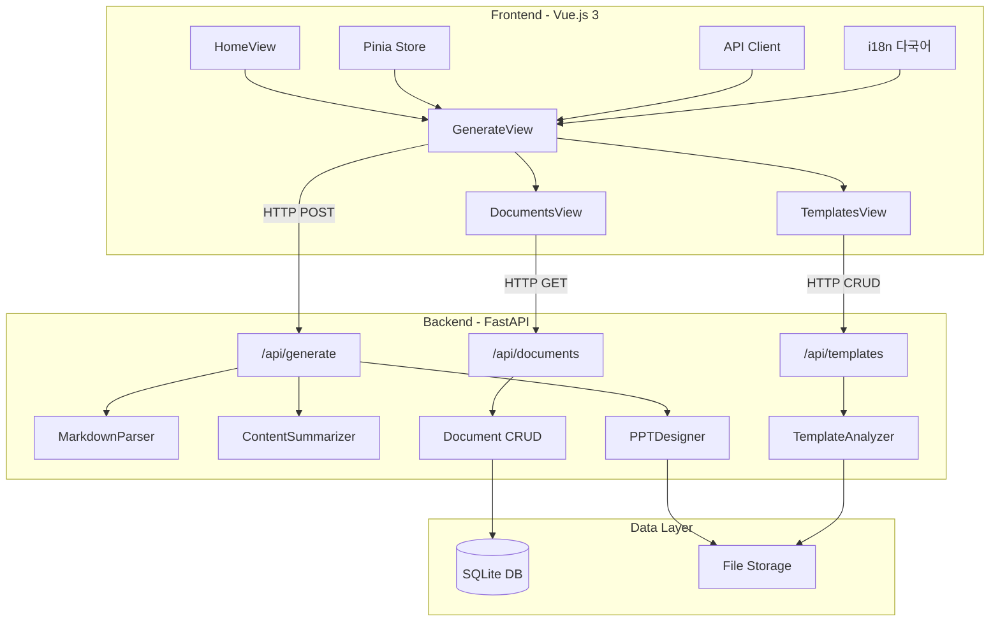

### 2.2 디렉토리 구조

```
ppt-doc-automation/
├── backend/                    # Python FastAPI 백엔드
│   ├── app/
│   │   ├── main.py            # FastAPI 앱 진입점
│   │   ├── config.py          # 환경 설정
│   │   ├── database.py        # SQLAlchemy 설정
│   │   ├── models/            # ORM 모델
│   │   │   ├── document.py    # 문서 모델
│   │   │   └── template.py    # 템플릿 모델
│   │   ├── schemas/           # Pydantic 스키마
│   │   ├── routers/           # API 라우터
│   │   │   ├── generate.py    # PPT 생성 API
│   │   │   ├── templates.py   # 템플릿 관리 API
│   │   │   └── documents.py   # 문서 이력 API
│   │   ├── services/          # 비즈니스 로직
│   │   │   ├── md_parser.py         # 마크다운 파서
│   │   │   ├── content_summarizer.py # 콘텐츠 요약
│   │   │   ├── ppt_designer.py      # PPT 디자인
│   │   │   ├── ppt_generator.py     # PPT 생성 (레거시)
│   │   │   └── template_analyzer.py # 템플릿 분석
│   │   └── utils/
│   └── requirements.txt
│
├── frontend/                   # Vue.js 3 프론트엔드
│   ├── src/
│   │   ├── main.js            # Vue 앱 진입점
│   │   ├── App.vue            # 루트 컴포넌트
│   │   ├── router/            # Vue Router
│   │   ├── stores/            # Pinia 상태관리
│   │   ├── views/             # 페이지 컴포넌트
│   │   ├── components/        # 재사용 컴포넌트
│   │   ├── api/               # API 클라이언트
│   │   └── i18n/              # 다국어 리소스
│   └── package.json
│
├── templates/                  # PPT 템플릿 저장소
├── output/                     # 생성된 PPT 파일
├── data/                       # SQLite 데이터베이스
└── docker-compose.yml          # Docker 설정
```

---

## 3. PPT 생성 파이프라인

### 3.1 처리 흐름도

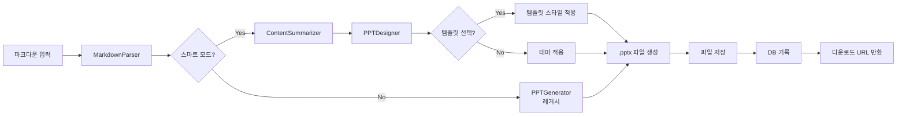

### 3.2 핵심 서비스 설명

#### 3.2.1 MarkdownParser (마크다운 파서)

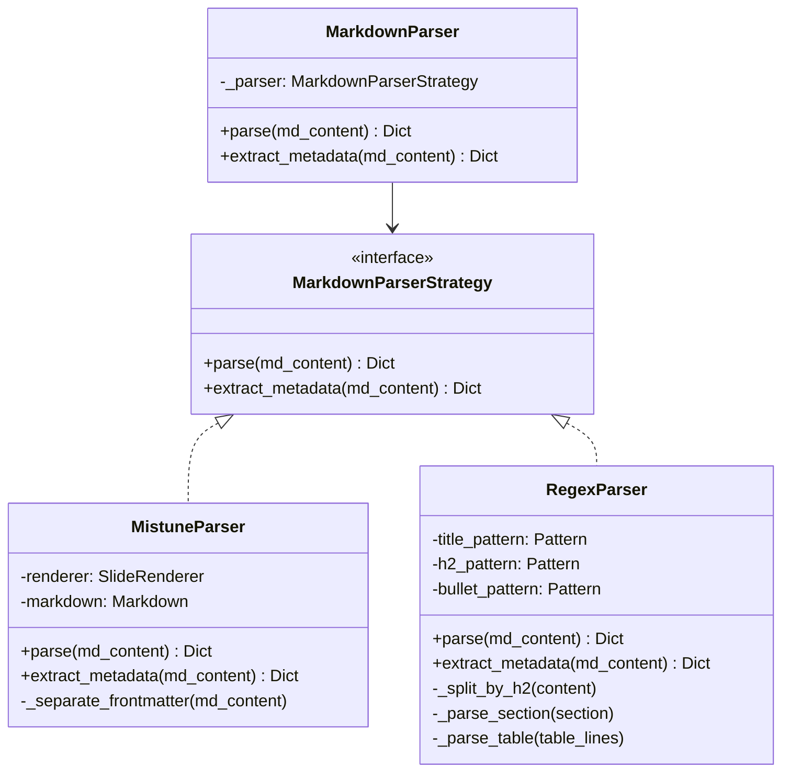

**역할**:
- 마크다운 문서를 슬라이드 데이터 구조로 변환
- `# H1` → 프레젠테이션 제목
- `## H2` → 새 슬라이드 시작
- 글머리 기호, 번호 목록, 테이블, 이미지, 코드 블록 파싱
- YAML 프론트매터 메타데이터 추출

#### 3.2.2 ContentSummarizer (콘텐츠 요약 에이전트)

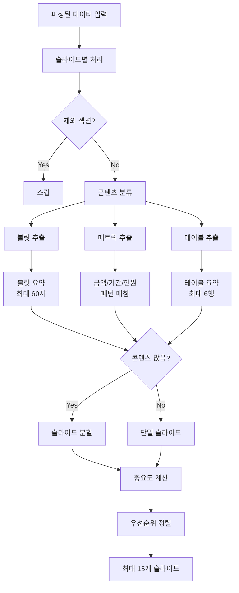

**핵심 기능**:
| 기능 | 설명 | 제한 |
|------|------|------|
| 불릿 요약 | 핵심 내용만 추출 | 슬라이드당 5개, 60자 |
| 테이블 요약 | 행 수 제한 | 최대 6행 |
| 중요도 산정 | 키워드 기반 우선순위 | 1-3점 |
| 슬라이드 분할 | 긴 콘텐츠 자동 분할 | 최대 15개 |

#### 3.2.3 PPTDesigner (PPT 디자인 에이전트)

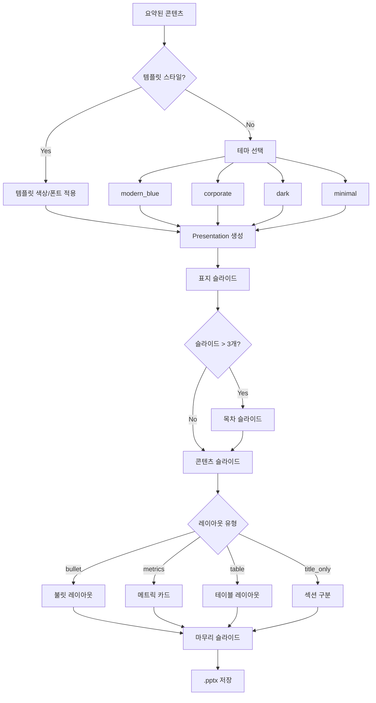

**색상 테마**:
```
modern_blue  : #0070C0 (파란색) - 깔끔하고 전문적
corporate    : #003366 (네이비) - 격식있는 기업용
dark         : #00BCD4 (시안)  - 다크 모드
minimal      : #333333 (그레이) - 미니멀 스타일
```

---

## 4. API 명세

### 4.1 PPT 생성 API

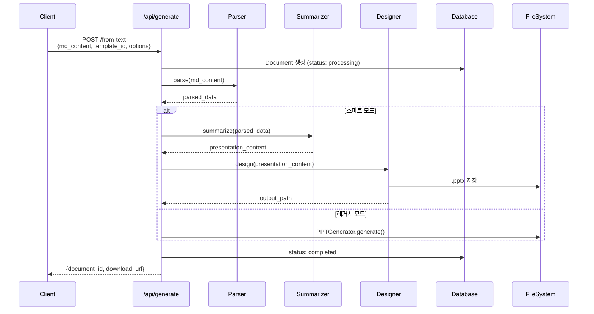

### 4.2 API 엔드포인트 목록

| 메서드 | 엔드포인트 | 설명 |
|--------|-----------|------|
| `POST` | `/api/generate/from-text` | 마크다운 텍스트로 PPT 생성 |
| `POST` | `/api/generate/from-file` | 마크다운 파일 업로드로 PPT 생성 |
| `GET` | `/api/generate/themes` | 사용 가능한 테마 목록 |
| `GET` | `/api/documents` | 생성 이력 조회 |
| `GET` | `/api/documents/{id}` | 문서 상세 조회 |
| `GET` | `/api/documents/{id}/download` | PPT 파일 다운로드 |
| `DELETE` | `/api/documents/{id}` | 문서 삭제 |
| `GET` | `/api/templates` | 템플릿 목록 조회 |
| `POST` | `/api/templates` | 템플릿 업로드 |
| `DELETE` | `/api/templates/{id}` | 템플릿 삭제 |

### 4.3 요청/응답 스키마

**PPT 생성 요청**:
```json
{
  "md_content": "# 제목\n## 슬라이드1\n- 내용",
  "template_id": 1,
  "options": {
    "smart_mode": true,
    "theme": "modern_blue"
  }
}
```

**PPT 생성 응답**:
```json
{
  "document_id": 123,
  "status": "completed",
  "message": "PPT가 성공적으로 생성되었습니다 (스마트 모드)",
  "download_url": "/api/documents/123/download"
}
```

---

## 5. 데이터베이스 스키마

### 5.1 ERD

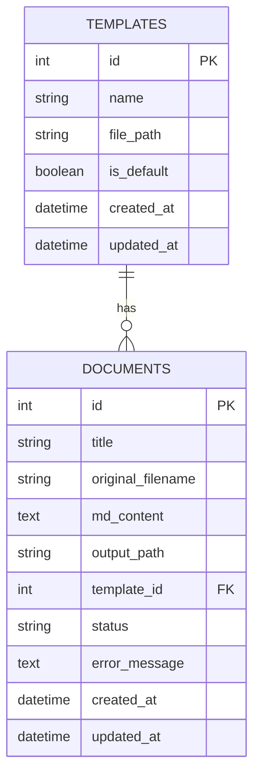

### 5.2 문서 상태 흐름

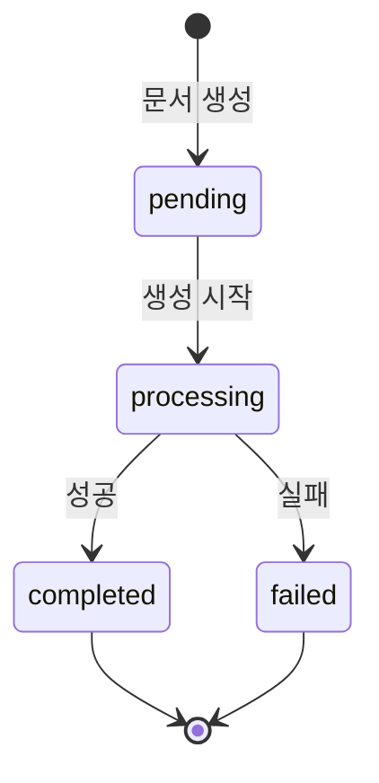

---

## 6. 프론트엔드 구조

### 6.1 페이지 구성

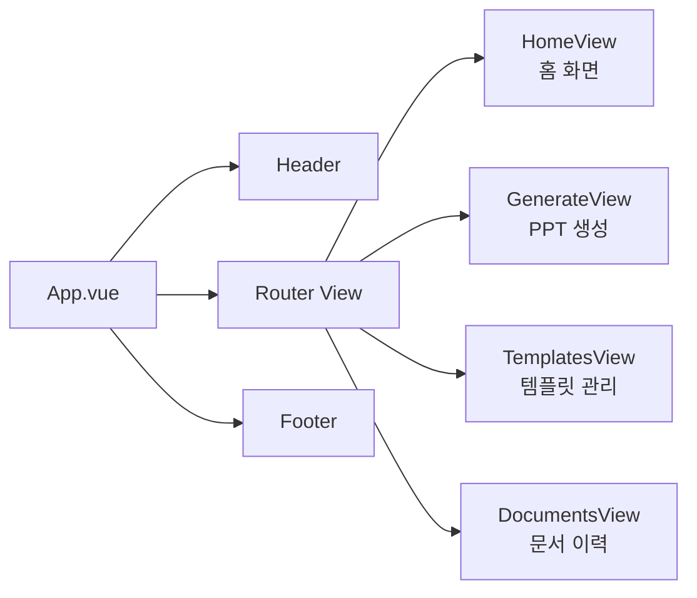

### 6.2 상태 관리 (Pinia)

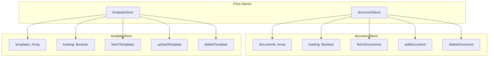

### 6.3 GenerateView 워크플로우

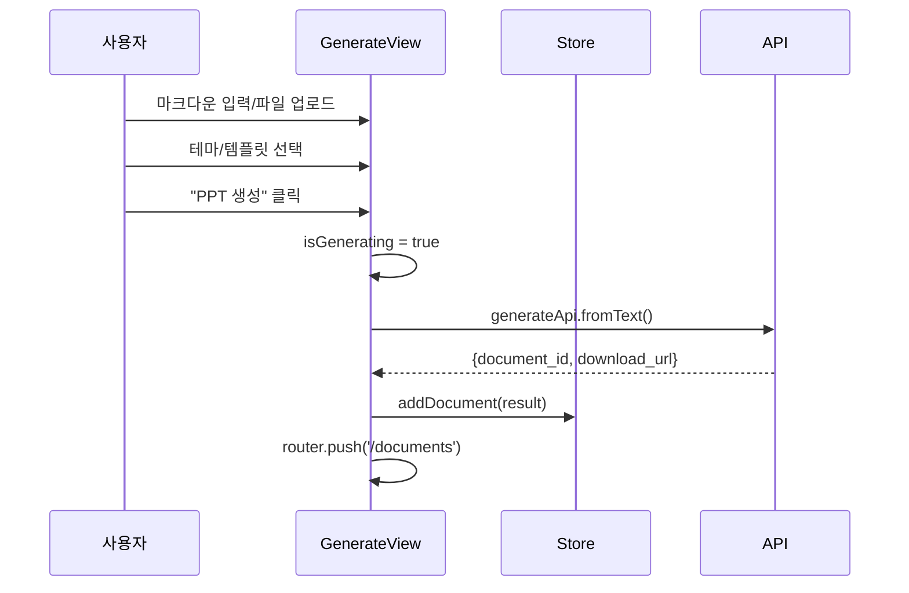

### 6.4 다국어 지원

| 언어 | 파일 | 상태 |
|------|------|------|
| 한국어 | `i18n/ko.json` | 기본 |
| 영어 | `i18n/en.json` | 지원 |
| 베트남어 | `i18n/vi.json` | 지원 |

---

## 7. 마크다운 입력 형식

### 7.1 기본 구조

```markdown
---
type: project-plan
author: 홍길동
date: 2026-01-05
---

# 프레젠테이션 제목

## 슬라이드 1 제목
- 불릿 포인트 1
- 불릿 포인트 2

## 슬라이드 2 제목
### 소제목
1. 번호 목록 1
2. 번호 목록 2

## 테이블 슬라이드
| 항목 | 설명 |
|------|------|
| A    | 설명1 |
| B    | 설명2 |

## 코드 슬라이드
```python
print("Hello, World!")
```
```

### 7.2 요소별 변환 규칙

| 마크다운 | PPT 변환 결과 |
|----------|--------------|
| `# H1` | 프레젠테이션 제목 |
| `## H2` | 새 슬라이드 시작 |
| `### H3` | 슬라이드 내 서브헤딩 |
| `- 항목` | 불릿 포인트 |
| `1. 항목` | 번호 목록 |
| `| 표 |` | 테이블 레이아웃 |
| ` ```code``` ` | 코드 블록 |
| `` | 이미지 삽입 |

---

## 8. 설정 및 환경변수

### 8.1 주요 설정 (config.py)

| 설정 | 기본값 | 설명 |
|------|--------|------|
| `DATABASE_URL` | `sqlite:///./data/ppt_automation.db` | DB 경로 |
| `TEMPLATES_DIR` | `./templates` | 템플릿 저장 경로 |
| `OUTPUT_DIR` | `./output` | 생성 파일 경로 |
| `MAX_UPLOAD_SIZE` | `10MB` | 최대 업로드 크기 |
| `STORAGE_TYPE` | `local` | 스토리지 유형 |
| `USE_LEGACY_PARSER` | `false` | 레거시 파서 사용 |

### 8.2 CORS 허용 출처

```python
CORS_ORIGINS = [
    "http://localhost:3000",
    "http://localhost:5173",
    "http://127.0.0.1:3000",
    "http://127.0.0.1:5173",
]
```

---

## 9. 실행 방법

### 9.1 로컬 개발 환경

```bash
# 백엔드 실행
cd ppt-doc-automation/backend
python -m venv venv
venv\Scripts\activate
pip install -r requirements.txt
uvicorn app.main:app --reload --port 8000

# 프론트엔드 실행 (새 터미널)
cd ppt-doc-automation/frontend
npm install
npm run dev
```

### 9.2 Docker 환경

```bash
cd ppt-doc-automation
docker-compose up --build
```

### 9.3 접속 URL

| 서비스 | URL |
|--------|-----|
| 프론트엔드 | http://localhost:5173 |
| 백엔드 API | http://localhost:8000 |
| API 문서 (Swagger) | http://localhost:8000/docs |
| API 문서 (ReDoc) | http://localhost:8000/redoc |

---

## 10. 확장 포인트

### 10.1 현재 지원 기능
- [x] 마크다운 → PPT 변환
- [x] 스마트 콘텐츠 요약
- [x] 4가지 색상 테마
- [x] 커스텀 템플릿 스타일 적용
- [x] 테이블 파싱 지원
- [x] 다국어 UI (한/영/베)
- [x] 문서 이력 관리

### 10.2 확장 가능 영역
- [ ] S3 클라우드 스토리지 연동
- [ ] AI 기반 콘텐츠 요약 (LLM)
- [ ] 이미지 자동 생성/삽입
- [ ] 실시간 협업 편집
- [ ] PDF 출력 지원
- [ ] 슬라이드 미리보기

---

## 11. 용어 정리

| 용어 | 설명 |
|------|------|
| **스마트 모드** | ContentSummarizer + PPTDesigner를 사용한 고급 PPT 생성 |
| **레거시 모드** | PPTGenerator만 사용한 기본 PPT 생성 |
| **프론트매터** | 마크다운 상단의 YAML 메타데이터 블록 |
| **슬라이드 레이아웃** | bullet, metrics, table, title_only 등 |
| **템플릿 스타일** | 업로드된 PPTX에서 추출한 색상/폰트 정보 |

---

*이 문서는 PPT 문서 자동화 시스템의 전체 구조와 동작 방식을 설명합니다.*
